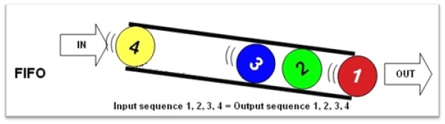
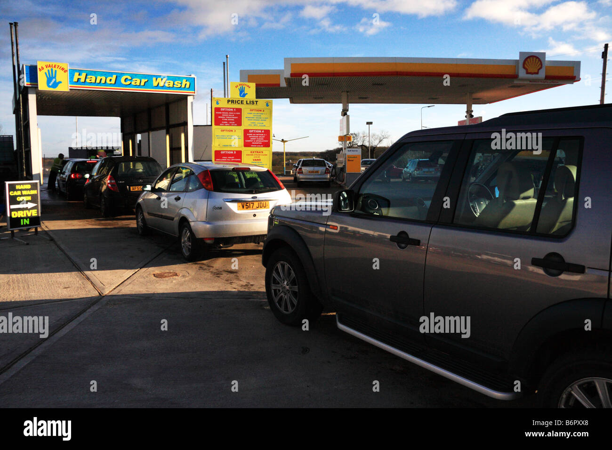
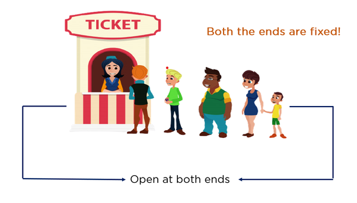
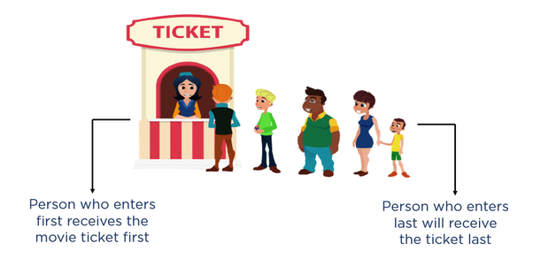
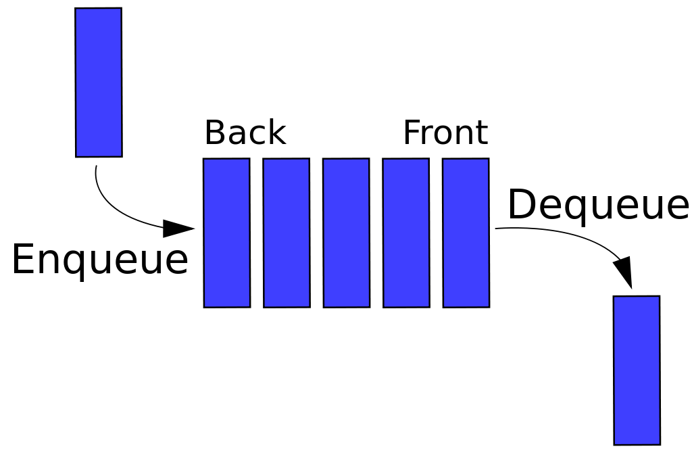
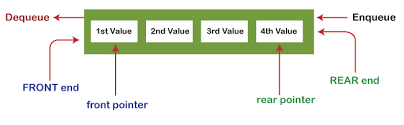

# Introduction to Queues

Queues are fundamental to data structures in programming. A queue is a close “cousin” of the stack; it’s a collection of objects inserted and removed according to the FIFO (First-in, first-out) principle. Meaning that the entity put in the queue first leaves the line (queue) first, and the entity that enters the queue last gets removed at the end.



The idea is that elements enter a queue through the back and are taken away from the front. An analogy for this is a line of individuals queuing to get on a carnival ride. Individuals waiting for such a ride enter at the rear of the line and get on the ride from the front of the line. To remember this concept, you can also use the acronym “FCFS,” which means first-come, first-served.

Another great example would be a car wash where cars queue up to get a wash. The vehicles stay in a line waiting for their turn. The first car to show up gets to wash first, while the last car remains until all other vehicles that came before it is gone. Now we can wash the last vehicle and close for the day when we have no vehicles left.


(*Source*: Alamy.com)

Let’s have a look at one more example.

### The Movie Ticket Counter


(*Source*: simplilearn.com)

Customers can only enter from the rear end and leave from the front in these ticket counters. All other paths are closed with the help of barricades. Furthermore, the person who enters the ticket line first will exit first and the last person will exit last.


(*Source*: simplilearn.com)

Stores, theaters, reservation centers, and other similar services typically process customer requests according to the FIFO principle. In addition, many computing devices also use FIFO queues, such as a networked printer or a Web server responding to requests. Therefore, a queue would be a logical choice for a data structure to handle calls to a customer service center or a wait-list at a restaurant. 

## Operations and Structure Of Queues

Unlike arrays and linked list, items in a queue cannot be operated from their respective locations. They can only be operated from the rare or front position. Also the structure of a queue depends on the perspective of the programmer. 


*An illustration of a queue with back at the left.*

(*source*: Wikipedia. com)



An illustration of a queue with the back on the right.

(*source*: Javapoint.com)

### enqueue(items)
The enqueue in python adds a new item to the queue. We can call this side the rare or the back.

### dequeue()

The dequeue() removes items from the front of the queue. We can call this side the front.

Let's see some picture illustration of how these two operations work in python. 

<p align="center">
    

    (*source*: geekflare.com)
</p>

<p align="center">
    
    
    (*source*: geekflare.com)
</p>

<p align="center">
    
    
    (*source*: geekflare.com)
</p>

<p align="center">
    
    
    (*source*: geekflare.com)
</p>

<p align="center">
    
    
    (*source*: geekflare.com)
</p>

<p align="center">
    
    
    (*source*: geekflare.com)
</p>

<p align="center">
    
    
    (*source*: geekflare.com)
</p>

We can write our own functions to add more functionality to the queue.

### Rear()
Returns the first item from the back or end of the queue.

<p align="center">
    
    
    (*source*: geekflare.com)
</p>

### Front()

Returns the first item from the front of the queue.

<p align="center">
    
    
    (*source*: geekflare.com)
</p>

### is_empty()

Returns the state of the queue. It tells us if the queue is empty or not.

<p align="center">
    
    
    (*source*: geekflare.com)
</p>

## Queue Implementation
Queue in Python can be implemented in the following ways:

1. list
2. collections.deque
3. queue.Queue

In this class we are going to talk about the first two. 

## List
The lists is a data structure in python. We are going to implement a queue using  a class in python.

### Step 1:

We need a queue class.

``` python
class Queue:
    pass
```

### Step 2:

We need to have an empty list to store the data. Let us name this `items`.

``` python
class Queue:

	def __init__(self):
		self.items = []
```

### Step 3:

Now we can start creating methods for our program. These methods will implement the various behaviors we talked about earlier in this chapter. 

``` python
class Queue:

	def enqueue(self, data):
		self.items.append(data)
		return data
```

### Step 4:

Now we can add the dequeue method which removes the first item from the queue.
We can do this by using the pop() method in python.

``` Python
class Queue:

	def dequeue(self):
		return self.itemss.pop(0)
```
Our queue is pretty much done at this point, but we can add other methods to access the first and last items in the list.

### Step 5:

``` python
class Queue:
	def rear(self):
		return self.items[-1]
```

### step 6:

``` python
class Queue:
	def front(self):
		return self.items[0]
```

### Step 7:

We can check whether the queue is empty with the is_empty() method we will create.

``` python
class Queue:
	def is_empty(self):
		return len(self.itemss) == 0
```
``` python
class Queue:

if __name__ == '__main__':
	queue = Queue()
```
Now let's look at the full code we have written.

``` python 
class Queue:
    #Create an instance of the class.
	def __init__(self):
		self.items = []
    #Add data to the queue
	def enqueue(self, data):
		self.items.append(data)
		return data
    #Delete the first item from the queue
	def dequeue(self):
		return self.items.pop(0)
    #Access item from the end of the queue
	def rear(self):
		return self.items[-1]
    #Access item from the front of the queue
	def front(self):
		return self.items[0]
    #Check if the queue is empty
	def is_empty(self):
		return len(self.items) == 0

if __name__ == '__main__':
	queue = Queue()

    #Check if the queue is empty

    print(queue.is_empty())

    #Adding elements to the queue
    queue.enqueue(1)
	queue.enqueue(2)
	queue.enqueue(3)
	queue.enqueue(4)
	queue.enqueue(5)

    #Check if the queue is empty
    print(queue.is_empty())

    #printing the front and end items using front and rear methods.
	print(queue.front(), end=' ')
	print(queue.rear())

    #Remove the element from the queue
    queue.dequeue()

    #printing the front and end items using front and rear methods.
	print(queue.front(), end=' ')
	print(queue.rear())

    ## removing all the elements
	queue.dequeue()
	queue.dequeue()
	queue.dequeue()
	queue.dequeue()

	#checking the is_empty method for the last time
	print(queue.is_empty())

```
Running our code will give us these reuslt. 

``` python
True
False
1 5
2 5
True
```

## Using Deque from Collections

A deque is referred to as a double-ended queue in which items can be inserted and deleted from either the right or the left side of the queue.

`append(data)` – used to add the data to the queue.

`popleft()` – used to remove the first element from the queue

Let's see the implementation:

``` python

from collections import deque

# creating deque object
queue = deque()

# Checking whether the queue is empty
print(len(queue) == 0)

# Adding the elements 
queue.append(1)
queue.append(2)
queue.append(3)
queue.append(4)
queue.append(5)

# checking whether queue is empty or not again
print(len(queue) == 0)

# rinting the queue
print(queue)

# removing the first elelement from the front
queue.popleft()

# printing the queue again
print(queue)

# removing all the elements from the queue
queue.popleft()
queue.popleft()
queue.popleft()
queue.popleft()

# checking whether queue is empty or not for the last time.
print(len(queue) == 0)
```

our output:

``` python
True
False
1
2
3
Size 2
4
5
True
```


