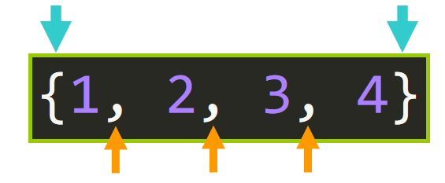
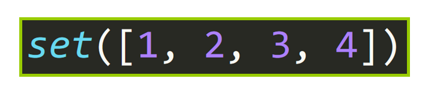
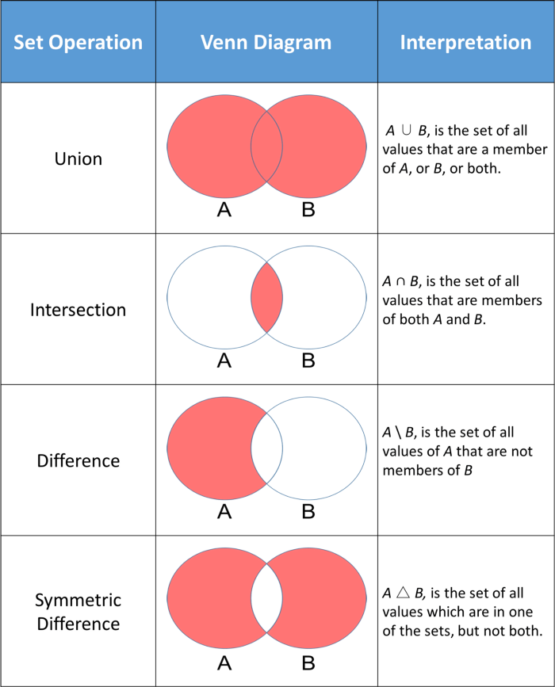

# Introduction to sets in Python
In this lesson, we are going to learn about sets in the Python programing language.

A set is a collection of unordered elements that are unique. In Python, sets are extraordinary because they have no duplicate values or items, so we can utilize them to eliminate duplicate elements from lists and tuples effectively. In addition, the elements in a set are immutable, which means we cannot change them. Some other immutable data types in Python are strings, tuples, and numbers such as integers and floats

## Creating a set

The syntax of a set is similar to other data structures like lists and dictionaries with minor differences. To create a set, we begin by writing a pair of curly brackets `{}`; inside the brackets, we separate the elements of the set by commas and a space(optional) just like we would do in a list or by using the built-in set() function.



*Creating a set looks similar to creating a dictionary; you enclose a bunch of items within braces.*

(*Source*: Freecodecamp.org)

A set can contain any number of elements regardless of type (integer, float, tuple, string etc). However, a set cannot have mutable elements like lists, sets or dictionaries as its elements (A frozen set can resolve this problem).

```python
# set of integers
>>> my_set = {1, 2, 3}
>>> print(my_set)

# set of mixed datatypes
>>> my_set = {1.0, "Hello", (1, 2, 3)}
>>> print(my_set)

```

### Using the `set()` Constructor
Another way to create a set is using the `set()` function or constructor. For example, we could Create a set from a list, tuple or string using the `set()` constructor to implement this. The data structure will be converted to a set, removing duplicate elements.



(*Source*: Freecodecamp.org)

Examples of using a `set()` constructor.

```python
# defining a set
{1, 2, 3, 4}
# Converting a string to a set
print(set('abcd'))
# prints
set(['a', 'c', 'b', 'd'])

# Converting a list to a set
print(set([1, 2, 3, 4]))
# prints
{1, 2, 3, 4}

# Converting a tuple to a set
print(set((1, 2, 3, 4)))
# prints
{1, 2, 3, 4}
```

--------------------------------------------------
:memo: If the element in the `set()` has duplicate values, they will be removed to create the set.
--------------------------------------------------

example:

```python
items = [1, 2, 2, 2, 2, 3, 3, 3, 3, 4, 1, 4]
print(set(items))
# prints
{1, 2, 3, 4}
```

### Modifying a set in Python
We said elements in a set are immutable earlier, but we need to understand that a set itself is mutable. However, since the elements are unordered, indexing cannot be done.  

The reason why we said the elements are immutable is because we cannot access or change them using slicing or indexing (common with a list). Sets include helpful built-in methods to help us perform common and essential functionality such as adding elements, deleting elements, and clearing the set.

--------------------------------------------------------
:memo: According to the Python Documentation:          
                                                      
The set type is mutable — the contents can be changed  
using methods like add() and remove(). Since it is     
mutable, it has no hash value and cannot be used       
as either a dictionary key or as an element of another set.
---------------------------------------------------------                                                   

Before we go into these built-in methods we can quickly talk about Membership Testing.

### Membership Testing
We can check if an element exists in the set by using the `in` operator.


This in an example:
``` python
a = "hhheeelllooo"
b = set(a)
print(b)
{'e', 'l', 'o', 'h'}

# Test if the characters 'e' and 'a' are in set b
'e' in b
True
'a' in b
False

#defining another set
a = {'apple', 'orange', 'banana', 'melon', 'mango'}
print('banana' in a)
True
print('papaya' in a)
False

#defining another set
b = set(['melon', 'orange', 'mango', 'banana', 'papaya'])
print('banana' in b)
True
print('papaya' in b)
True
```
## Methods of set

### Set Size
We can obtain the size of a set (the number of elements) using the built in len() function. in poython.

``` python
a = {'apple', 'orange', 'banana', 'melon', 'mango'}
print (a)
print ('size of a:', len(a))
# prints
{'melon', 'orange', 'mango', 'banana', 'apple'}
size of a: 5
```

### Add to a Set
To add items to a set, we utilize the built in `.add()` method. We pass the element we want to add as an argument.

``` python
e = {1, 2, 3, 4}
.add(5)
print(e)
{1, 2, 3, 4, 5}
```

example 2:

``` python
a = [random.randint(0, 10) for x in range(10)]
print ('list =>', a)
m = set(a)
print ('set =>', m)
m.add(10)
print ('after add =>',  m)
# prints
list => [3, 4, 7, 2, 8, 0, 4, 1, 0, 4]
set => {0, 1, 2, 3, 4, 7, 8}
after add => {0, 1, 2, 3, 4, 7, 8, 10}
```

We will need to use a loop to add multiple elements since the `add()` method accepts only a single argument.

We cannot add a list to a set since the list cannot be hashed.

``` python
m.add(5)
print ('after add =>', m)
m.add([21, 22])
print (m)
# prints
TypeErrorTraceback (most recent call last)
 in ()
      5 m.add(10)
      6 print ('after add =>', m)
----> 7 m.add([21, 22])
      8 print (m)

TypeError: unhashable type: 'list
```

However, we can add a tuple since it is not mutable and hence hashable.

``` python
m.add((19, 20))
print (m)
# prints
{0, 3, 4, 5, 6, 7, (19, 20), 9, 10]}
```

### Delete from a Set

We can make use of 3 ways to delete element from a set.
1. `.remove()`
2. `.discard()`
3. `.pop()`

-----------------------------------------------------
:memo: According to freecodecamp.org:
The first two methods (.remove() and .discard()) work exactly the same when the element is in the set. The new set is returned:

``` python
#Remove a single element from a set using remove().
a = {1, 2, 3, 4}
a.remove(3)
print(a)
{1, 2, 4}

a = {1, 2, 3, 4}
a.discard(3)
print(a)
{1, 2, 4}
```

The key difference between these two methods is that if we use the `.remove()` method, we run the risk of trying to remove an element that doesn't exist in the set and this will raise a `KeyError`:

``` python
# A KeyError is raised if the element is not in the set. (Running the same code as above a couple of times generates a random sequence without 10 in the set.)

a = {1, 2, 3, 4}
a.remove(5)
Traceback (most recent call last):
  File "<pyshell#102>", line 188, in <module>
    a.remove(5)
KeyError: 5
```
We will never have that problem with `.discard()` since it doesn't raise an exception if the element is not found. This method will simply leave the set intact, as you can see in this example:

``` python
# Need to remove an element from a set without the pesky KeyError? Use discard().

a = {1, 2, 3, 4}
a.discard(5)
print(a)
{1, 2, 3, 4}
```
The third method `(.pop())` will remove and return an arbitrary element from the set and it will raise a KeyError if the set is empty.

``` python
a = {1, 2, 3, 4}
a.pop()
1
a.pop()
2
a.pop()
3
print(a)
{4}
a.pop()
4
print(a)
set()
>>> a.pop()
Traceback (most recent call last):
  File "<pyshell#119>", line 1, in <module>
    a.pop()
KeyError: 'pop from an empty set'
```

---------------------------------------------------------

### Clear the Set
To delete all the elements in a set, the `.clear()` method is used.

``` python
a = {1, 2, 3, 4}
a.clear()
a
set()
len(a)
0
```
## Set Operations
We can utilize some mathematical set theory operations in python. `union(|)`, `intersection (&)`, `difference (-)`, and `symmetric difference (^)` are all available in the python programming language.

The image below shows a couple standard math operations on two sets A and B. The red part of each Venn diagram is the resulting set of a given set operation


(*source*: https://towardsdatascience.com)

### Union

Union creates a new set with all elements of two sets.
